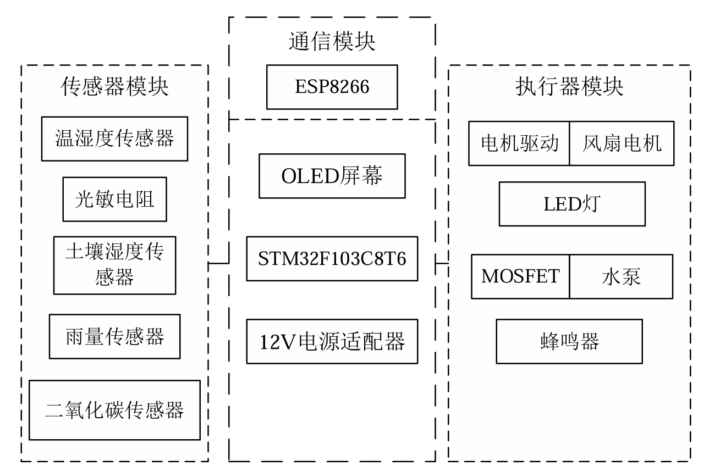
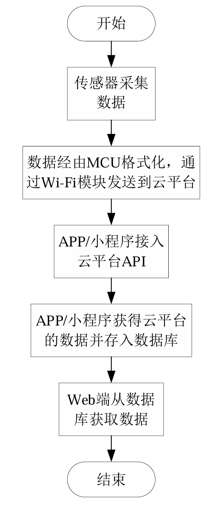
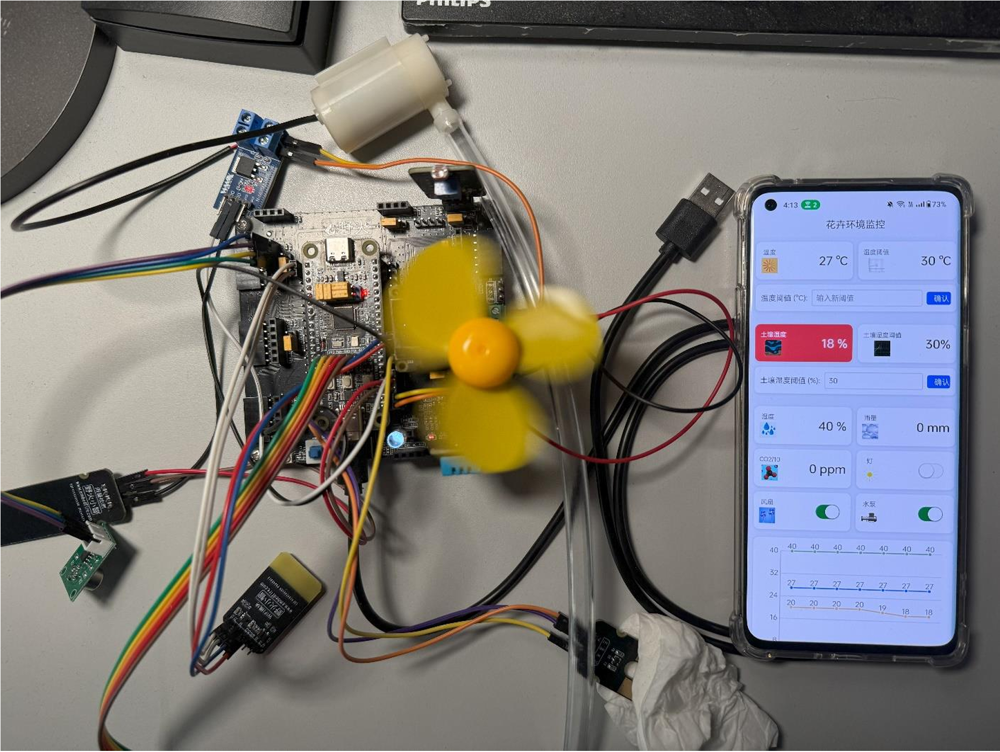

# 智能花卉培育环境监控系统 (Smart Flower Cultivation System) 🌱

本系统以 **STM32F103** 微控制器为核心，综合运用传感器技术、无线通信（ESP8266 & MQTT）、云数据库（uniCloud）等多种技术，设计并实现了一款多端联动的花卉培育环境监测与智能调控模拟系统。旨在为花卉提供适宜的生长环境，并通过直观的数据展示与及时的告警机制，帮助用户轻松掌握培育动态。

---

## ✨ 主要功能 (Features)

*   **实时环境监测**:
    *   通过多种传感器（如温湿度、土壤湿度、光照强度等）实时采集关键环境参数。
    *   数据在本地 **OLED 屏**、**APP (iOS/Android)**、**微信小程序**及 **Web 端**同步展示。
*   **历史数据追溯与可视化**:
    *   APP、微信小程序及 Web 端可查看传感器历史数据。
    *   以**折线图**形式直观呈现环境参数的变化趋势，便于分析与决策。
*   **智能告警机制**:
    *   当监测到环境参数偏离预设安全范围时，APP 和微信小程序会触发**视觉告警**（相应数据卡片标记为红色）。
*   **自动化环境调控**:
    *   **散热风扇** (TB6612FNG 驱动): 环境温度过高时自动开启，并伴有蜂鸣器告警。
    *   **水泵** (MOSFET 控制): 土壤湿度低于设定阈值时自动开启，为土壤补水。
    *   **LED 补光灯**: 光照强度不足时自动点亮，补充光照。
    *   **有源蜂鸣器**: 用于多种状态的声光告警。
*   **多端远程控制与配置**:
    *   通过 APP 及微信小程序可**远程手动控制**风扇、水泵和 LED。
    *   温度、土壤湿度的**阈值可在线调整**。
    *   手动控制操作完成后，系统会在一段时间后**自动切换回智能模式**。
*   **设备状态显示**:
    *   本地 OLED 屏、APP、微信小程序和 Web 端均可实时显示各执行器（风扇、水泵、LED）的当前工作状态。

---

## 🛠️ 技术栈 (Tech Stack)

*   **主控 MCU**: `STM32F103C8T6` (基于标准外设库)
*   **无线通信**: `ESP8266` (AT 指令)
*   **物联网协议**: `MQTT` (连接至 OneNet 物联网平台)
*   **云端服务**: `uniCloud` (云数据库、云函数等)
*   **本地显示**: `OLED (I2C)`
*   **执行器驱动**: `TB6612FNG` (电机驱动), `MOSFET`
*   **前端框架 (APP/小程序/Web)**: `Vue.js` 
*   **编程语言**: `C` (STM32), `JavaScript` (Vue.js/uni-app)

---

## 🏗️ 系统架构 (System Architecture)

**

**简要描述：** 传感器数据由 STM32 采集处理后，通过 ESP8266 模块以 MQTT 协议上传至 OneNet 平台，APP和微信小程序从OneNet 获取传感器数据，通过云函数存入传感器数据到阿里云数据库，WEB端通过云函数从云数据库中获取传感器数据，APP和微信小程序可下发控制指令至 STM32。

---

## 🚀 代码仓库 (Code Repositories)

本项目由以下几个独立仓库组成，共同构成了完整的智能花卉培育系统：

*   🖥️ **MCU (STM32 Firmware)**:
    *   [idea-21/Smart-Flower-Cultivation-System](https://github.com/idea-21/Smart-Flower-Cultivation-System)
    *   *负责传感器数据采集、本地控制逻辑、与ESP8266通信等。*
*   📱 **APP (iOS/Android)**:
    *   [idea-21/APP-Smart-Flower-Cultivation-System](https://github.com/idea-21/APP-Smart-Flower-Cultivation-System)
    *   *基于 Vue.js (uni-app) 开发，用于远程监控、控制和数据可视化。*
*   💬 **微信小程序 (WeChat Mini Program)**:
    *   [idea-21/MINI-APP-Smart-Flower-Cultivation-System](https://github.com/idea-21/MINI-APP-Smart-Flower-Cultivation-System)
    *   *基于 Vue.js (uni-app) 开发，功能与APP类似，提供便捷的微信内体验。*
*   🌐 **WEB 端 (Web Application)**:
    *   [idea-21/WEB-Smart-Flower-Cultivation-System](https://github.com/idea-21/WEB-Smart-Flower-Cultivation-System)
    *   *基于 Vue.js 开发，提供浏览器端的监测界面。*

---

## 📸 项目截图/演示 (Screenshots/Demo)

**
